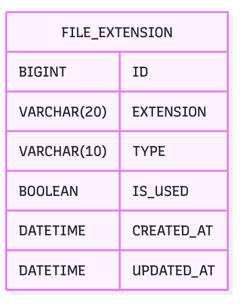

# file-ext-admin

파일 확장자 관리 기능을 제공하는 Spring Boot 기반의 관리자 웹 애플리케이션입니다.  
관리자가 시스템에서 사용 가능한 확장자 유형을 등록 및 제어할 수 있으며, 확장자 사용 여부를 실시간으로 관리합니다.

## 기술 스택

### Backend
- Java 17
- Spring Boot 3.4
- Spring Web
- JDBC + MyBatis (`@Mapper` 기반 SQL 작성)
- MySQL (Docker 컨테이너)
- Lombok
- Gradle

### Frontend
- Thymeleaf
- Bootstrap
- jquery
- Axios

### Infra
- AWS EC2 (Amazon Linux 2023)
- Docker & Docker Compose

## 배포 환경
- Amazon EC2에 MySQL을 Docker로 띄우고, Spring Boot 애플리케이션을 `.jar` 파일로 실행

## 관리자 기능
[API 명세 보기 (Swagger)](http://www.xxihye.online/swagger-ui/index.html)
- 커스텀 확장자 등록 및 수정
- 고정 확장자 사용 여부 On/Off 전환

### 고려사항
- 확장자명 중복 등록 방지 (확장자명 컬럼 unique 제약 설정)
- 최대 200개 등록 제한
- 백엔드/프론트엔드 확장자명 유효성 검증 및 제한 (대소문자만 입력 가능, 최대 길이 20자 제한, 공백 제거)
- 예외 처리에 따른 커스텀 에러메시지 응답
- 고정 확장자 삭제 방지

### ERD

